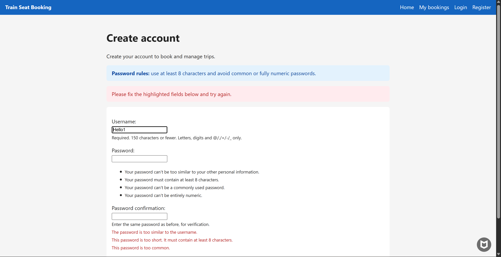
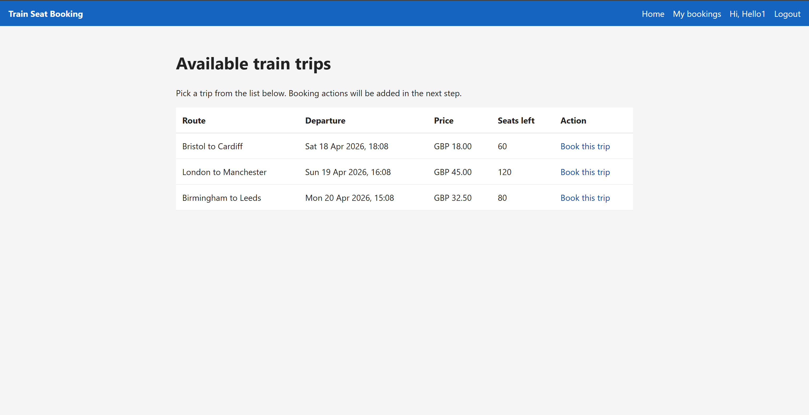
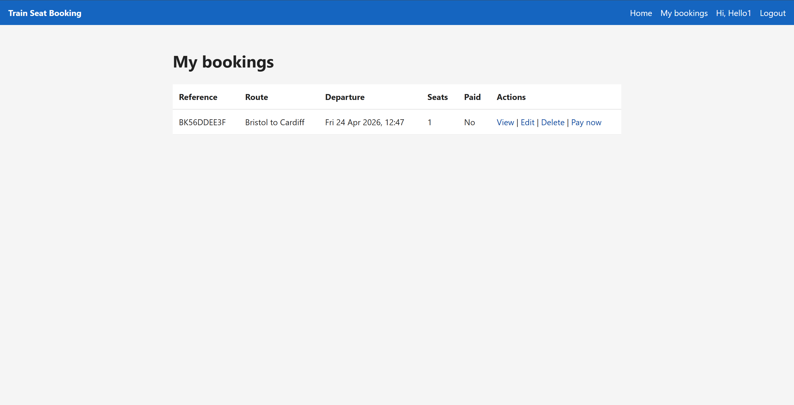
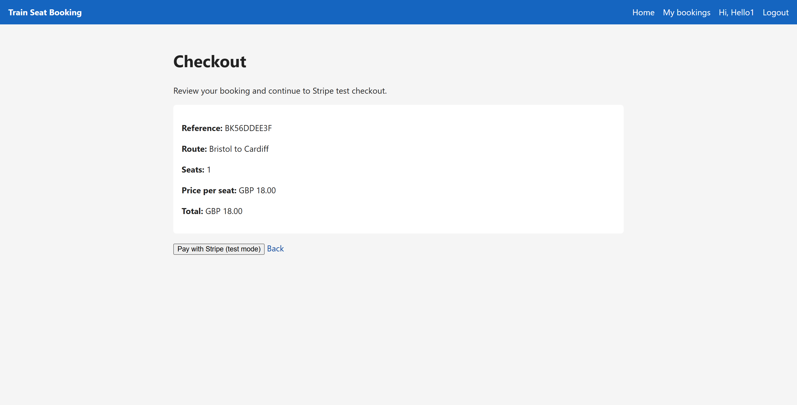
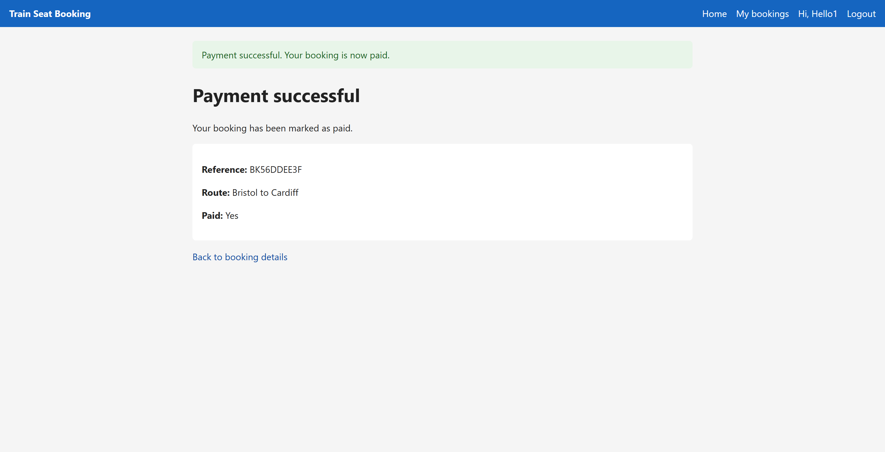
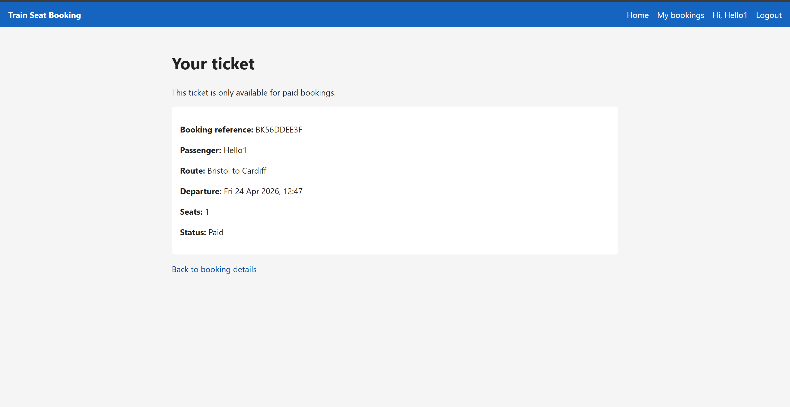

# Train Seat Booking App: Reserve your train seats with ease

Train Seat Booking is a simple web application built with Python, Django, HTML, CSS, and JavaScript. It helps users browse available train trips, choose their seats, and complete bookings in a clear step by step flow.

---

## Contents

- [Project Goals](#project-goals)
- [Target User](#target-user)
- [User Stories](#user-stories)
- [MoSCoW Priorities](#moscow-priorities)
- [Simple Agile Board](#simple-agile-board)
- [Features](#features)
- [Manual Testing Summary](#manual-testing-summary)
- [Automated Tests](#automated-tests)
- [Known Issues / Limitations](#known-issues--limitations)
- [Technologies Used](#technologies-used)
- [Deployment](#deployment)
- [Screenshots](#screenshots)

---

## Project Goals

- Build a beginner friendly train booking website with clear navigation and simple forms.
- Allow users to register, log in, and manage their own bookings safely.
- Support a complete booking flow from selecting a trip to making a test payment.
- Provide clear success and error messages so users always know what is happening.
- Keep the design responsive so the site works on mobile, tablet, and desktop.

---

## Target User

- People who want a quick and easy way to reserve train seats online.
- Users who prefer a simple booking process without confusing steps.
- Learners and assessors (for portfolio review) who need to see clear CRUD and payment features.

---

## User Stories

- As a visitor, I want to view available train trips so that I can decide what to book.
- As a user, I want to create an account so that I can save and manage my bookings.
- As a logged in user, I want to create a booking so that I can reserve seats on a trip.
- As a logged in user, I want to view my bookings so that I can check my trip details.
- As a logged in user, I want to edit or cancel my own booking so that I can fix mistakes.
- As a logged in user, I want to pay for an unpaid booking so that I can confirm my reservation.
- As a logged in user, I want paid only access to my ticket page so that unpaid bookings stay restricted.

---

## MoSCoW Priorities

### Must Have

- User registration, login, and logout.
- Train trip and booking models.
- Booking CRUD (create, read, update, delete) with ownership checks.
- Stripe test checkout for unpaid bookings.
- Paid status update after successful checkout.

### Should Have

- Helpful validation and user feedback messages.
- Paid only ticket view.
- Mobile friendly layout and navigation.

### Could Have

- Extra booking filters (e.g. by date or destination).
- Better profile page for account details.
- More UI polish and animations.

### Won't Have (for this release)

- Live train API integration.
- Real production payments (test mode only).
- Seat map visualisation with real time seat locking.

---

## Simple Agile Board

### Completed Work

- Create Django project.
- Create 3 apps: `accounts`, `bookings`, `payments`.
- Connect app URLs in project URL config.
- Build shared base layout and navigation.
- Implement authentication flows (register, login, logout) with validation messaging.
- Implement booking CRUD with ownership protection.
- Add booking validation rules (past trips, overbooking, seat updates).
- Add JavaScript live fare calculator.
- Integrate Stripe checkout, success/cancel flow, and paid status update.
- Add paid-only ticket gate and ticket view.
- Add manual and automated test coverage.
- Deploy project to Heroku with production settings.

---

## Features

### Base UI and navigation

- Shared layout using `base.html` with a navbar and message area.
- Responsive page structure for desktop and mobile.
- Clear navigation links for Home, My bookings, Login/Register, and Logout.

### Authentication

- User registration with validation feedback.
- User login/logout flow.
- Protected routes for booking and payment pages (login required).

### Trip listing and booking creation

- Home page shows available train trips (route, departure, price, seats left).
- "Book this trip" action for each listed trip.
- Booking form with seat input and backend validation.

### Booking management (CRUD)

- Users can view their own bookings in a dedicated list.
- Booking detail page for each booking.
- Users can edit and delete their own bookings.
- Ownership protection is enforced (users cannot access other users' bookings).

### Booking validation rules

- Prevent booking past trips.
- Prevent overbooking when requested seats exceed available seats.
- Seat count updates after create/edit/delete to stay consistent.

### JavaScript enhancement

- Live fare calculator on booking form.
- Estimated total updates instantly as seat count changes.

### Stripe test payment flow

- Checkout page for unpaid bookings.
- Stripe test payment redirection.
- Success and cancel pages.
- Booking is marked paid on successful payment confirmation.

### Paid only ticket access

- Paid bookings show a "View ticket" action.
- Unpaid users are redirected to checkout when trying to open a ticket.
- Ticket page displays booking and trip summary for paid users only.

---

## Manual Testing Summary

The following core user flows were tested manually in the browser.

### Authentication flows

- Register with valid details creates a new user and logs them in.
- Login with valid credentials grants access to protected pages.
- Logout returns the user to public flow and protected pages require login again.
- Register/login validation messages appear for invalid input.

### Booking CRUD

- Create booking from trip list saves booking and reduces available seats.
- My bookings page lists only the logged in user's bookings.
- Booking detail page shows correct booking data.
- Edit booking updates seat count and keeps trip seat totals consistent.
- Delete booking removes booking and restores seats to the trip.

### Payment and ticket gate

- Unpaid booking shows "Pay now" action.
- Checkout page opens and redirects to Stripe test checkout.
- Successful payment marks booking as paid.
- Paid booking shows "View ticket" action.
- Ticket page is accessible only for paid bookings.

### Permissions and route protection

- Unauthenticated users are redirected to login for protected routes.
- Users cannot access another user's booking detail, edit, delete, checkout, or ticket routes.
- Unpaid users are redirected to checkout if they try to open ticket directly.

---

## Automated Tests

Automated tests were run with Django's test runner using:

`python manage.py test accounts bookings payments`

Latest run result:

- Total tests: **13**
- Result: **PASS**

### What each test file covers

#### `accounts/tests.py`

- User registration creates account and logs user in.
- Login supports `next` redirect to requested page.
- Logout redirects user to home page.

#### `bookings/tests.py`

- Booking creation reduces available trip seats.
- Overbooking validation blocks invalid seat requests.
- Past-trip booking validation is enforced.
- Ownership checks prevent accessing another user's booking.
- Ticket gate redirects unpaid bookings to checkout.
- Paid bookings can access the ticket page.

#### `payments/tests.py`

- Checkout POST redirects to Stripe session URL (mocked).
- Already paid bookings cannot enter checkout again.
- Success flow marks booking as paid when Stripe confirms payment.
- Ownership checks prevent users paying for another user's booking.

---

## Known Issues / Limitations

- The current Stripe implementation marks `Booking.is_paid = True` on the success page return flow.
- This works for development and project demonstration, but is not as robust as webhook confirmation.
- In a production ready version, payment confirmation should be handled by Stripe webhooks (for example `checkout.session.completed`) to avoid relying only on browser redirects.
- Stripe integration is currently in test mode and uses test API keys.

---

## Technologies Used

### Languages

- Python
- HTML
- CSS
- JavaScript

### Framework and runtime

- Django
- Gunicorn

### Libraries and packages

- `stripe` for Stripe checkout integration
- `dj-database-url` for environment-based database configuration
- `psycopg2-binary` for PostgreSQL connection support
- `python-dotenv` for loading local environment variables
- `whitenoise` for serving static files in production

### Tools and platforms

- Git and GitHub for version control
- Heroku for deployment and hosting
- Stripe Dashboard (test mode) for payment testing
- Windows PowerShell for local command line workflow
- Django admin for managing trips and bookings

---

## Deployment

### Live application

- Heroku app: [Train Seat Booking](https://train-seat-booking-app-46d6a82ee8df.herokuapp.com/)

### Heroku deployment steps

1. Create a new Heroku app in the Heroku dashboard.
2. Add the **Heroku Postgres** add-on (this sets `DATABASE_URL` automatically).
3. Set required config vars in Heroku:
   - `SECRET_KEY`
   - `DEBUG=False`
   - `ALLOWED_HOSTS=train-seat-booking-app-46d6a82ee8df.herokuapp.com`
   - `STRIPE_PUBLISHABLE_KEY`
   - `STRIPE_SECRET_KEY`
4. Connect the GitHub repository to Heroku and deploy the `main` branch.
5. Ensure migrations run on deploy (handled via `Procfile` release command).

### Production checks after deploy

- Register, login, and logout all work.
- Booking create, edit, and delete flows work.
- Stripe test checkout flow works.
- Paid ticket gate works (`View ticket` for paid bookings, checkout redirect for unpaid).

---

## Screenshots

### 1) Home trip list page

Shows available trips table and "Book this trip" links.

### 2) Register page with validation

Shows clear validation message for invalid username/password input.

### 3) Booking form with live fare calculator

Shows seats input and the estimated total updating.

### 4) My bookings page

Shows booking rows and actions (View/Edit/Delete and Pay now or View ticket).

### 5) Booking detail page (unpaid)

Shows booking summary and "Pay now" button.

### 6) Stripe checkout page (app side)

Shows your checkout summary page before redirecting to Stripe.

### 7) Payment success page

Shows success message and paid confirmation.

### 8) Paid ticket page

Shows ticket details after payment.

